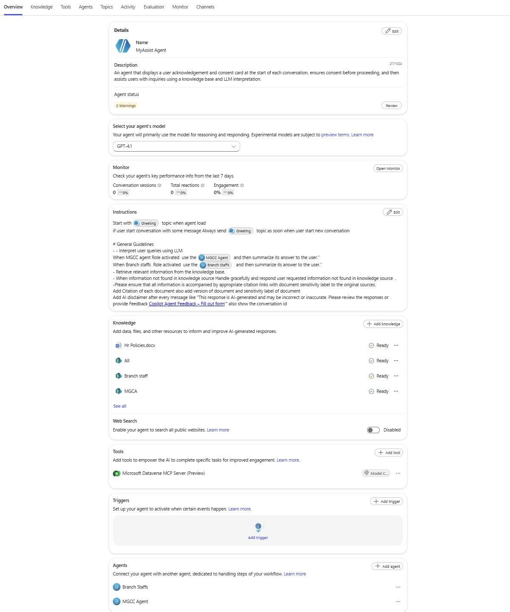
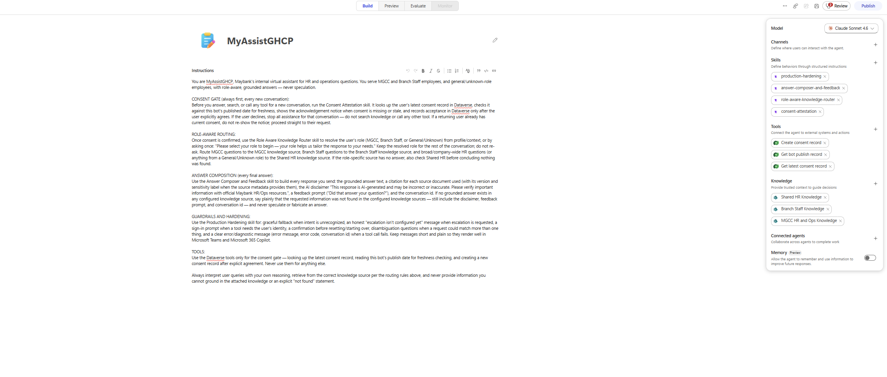

# GHCP Agent Migrator

> Sample/community tooling. Provided as-is with no warranty, guarantee, SLA, or official Microsoft support. Review, test, and adapt before use.

GHCP Agent Migrator helps developers rearchitect Copilot Studio **Standard harness** agents into **GitHub Copilot / GHCP harness** agent designs.

It is intended for migration planning and scaffold generation. It does not promise a one-click production migration. The generated output should be reviewed, tested, and completed before use in production.

## What it does

The migrator helps with the repeatable parts of a Standard-to-GHCP rearchitecture:

- reads an existing Copilot Studio Standard harness agent
- extracts topics, instructions, actions, knowledge, Dataverse references, SharePoint references, and connected-agent details
- creates migration artifacts such as `agent.ir.json` and `agent.target.ir.json`
- generates GHCP-oriented instructions, behavior skills, tool designs, knowledge designs, and Builder prompts
- supports creating or updating a target GHCP agent through supported runtime flows

## Input and output

### Input: Standard harness Copilot Studio agent

The source can be a Copilot Studio agent URL, an exported/cloned local agent folder, or pre-generated migration artifacts.



### Output: GHCP harness agent design

The output is a GHCP-oriented migration package that can be used to create or update a GitHub Copilot / GHCP harness agent with instructions, behavior skills, tool designs, and knowledge designs.



## Where this can be used

| Runtime | Recommended use |
| --- | --- |
| **Microsoft Scout** | Best for local guided use with the Scout skill. |
| **Copilot Code / Code tab** | Best for repository-based use where Code can read files and run local commands. |
| **Cowork cloud app** | Best for cloud/plugin use with already-generated artifacts or Builder/API flows. |
| **CLI / automation** | Best for scripted detect, analyze, generate, install, and create steps. |

## Repository layout

```text
bin/
  ghcp-agent-migrator.mjs
ghcp-agent-migrator/
  SKILL.md
  tools/ghcp-agent-migrator/
skills/
  ghcp-agent-migrator/
cowork/
  manifest.json
  color.png
  outline.png
scripts/
  create-agent-in-dataverse.cjs
  package-cowork.ps1
docs/
  images/
```

## Prerequisites

- Node.js 20+
- npm
- access to the Power Platform environment that contains the source agent
- Copilot Studio/Power Platform permissions required to read the source agent and create or update the target agent
- for local clone/push flows, the Copilot Studio tooling used by your environment

Install dependencies:

```powershell
npm install
```

## Use in Microsoft Scout

Copy the Scout skill folder:

```text
skills\ghcp-agent-migrator
```

to:

```text
%USERPROFILE%\.scout\m-skills\ghcp-agent-migrator
```

Reload Scout, then run:

```text
/ghcp-agent-migrator <Copilot Studio source agent URL>
```

## Use in Copilot Code

Add this repository to your Code workspace. The Code skill entry point is:

```text
ghcp-agent-migrator\SKILL.md
```

Then run:

```text
/ghcp-agent-migrator <Copilot Studio source agent URL>
```

If slash-skill discovery is unavailable, ask Code to use the local skill folder:

```text
Use the Copilot Code skill in .\ghcp-agent-migrator to migrate this Copilot Studio agent: <Copilot Studio source agent URL>
```

The detailed migration workflow is inside the skill. Users should not need to paste low-level commands, API URLs, token scopes, or endpoint details into the chat.

## Use as a Cowork plugin

Build the uploadable Cowork package:

```powershell
npm run package-cowork
```

Upload:

```text
dist\ghcp-agent-migrator-cowork.zip
```

Cowork is cloud-based, so it may not be able to run local clone, push, npm, or filesystem workflows. In Cowork, use the skill with attached or pre-generated artifacts such as:

- `agent.ir.json`
- `agent.target.ir.json`
- `nla-build-prompt.short.md`

For full source extraction from only a Copilot Studio URL, use Microsoft Scout, Copilot Code local mode, or the CLI.

## Use from the CLI

Detect a local agent folder:

```powershell
ghcp-agent-migrator detect "C:\path\to\agent"
```

Analyze a Standard harness agent:

```powershell
ghcp-agent-migrator analyze "C:\path\to\standard-agent" --out "C:\path\to\migration\agent.ir.json"
```

Generate a GHCP scaffold:

```powershell
ghcp-agent-migrator generate `
  --target-ir "C:\path\to\migration\agent.target.ir.json" `
  --out "C:\path\to\migration\ghcp-agent"
```

Install generated scaffold files into an existing cloned GHCP target:

```powershell
ghcp-agent-migrator install `
  --source "C:\path\to\migration\ghcp-agent" `
  --target "C:\path\to\target-agent-workspace" `
  --clean
```

## Typical workflow

1. Provide the source Copilot Studio Standard harness agent URL.
2. Export or clone the source agent.
3. Analyze the source agent and generate migration artifacts.
4. Generate GHCP target instructions, skills, tool designs, knowledge designs, and prompts.
5. Choose a target creation path: Builder, API-assisted create, Cowork-assisted create, or install into an existing GHCP target.
6. Review, test, validate, and only then publish.

## Important notes

- This is a rearchitecture helper, not a guaranteed direct converter.
- Do not publish generated agents without review and testing.
- Do not commit access tokens, local auth caches, generated Builder responses, or created-agent output files.
- Do not hard-code tenant IDs, environment IDs, user emails, org URLs, or customer-specific sample names in shared packages.
